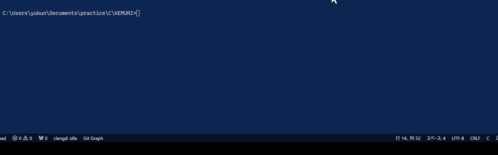

# Kemuri on C language

## これはなに？

難解プログラミング言語の１つ， [KEMURI](https://ja.wikipedia.org/wiki/KEMURI_(%E3%83%97%E3%83%AD%E3%82%B0%E3%83%A9%E3%83%9F%E3%83%B3%E3%82%B0%E8%A8%80%E8%AA%9E)) のインタプリタのC実装です．

## ビルド

`make`コマンドでビルドできます．

## 使い方

`bin`ディレクトリにできる実行ファイルから遊べます
